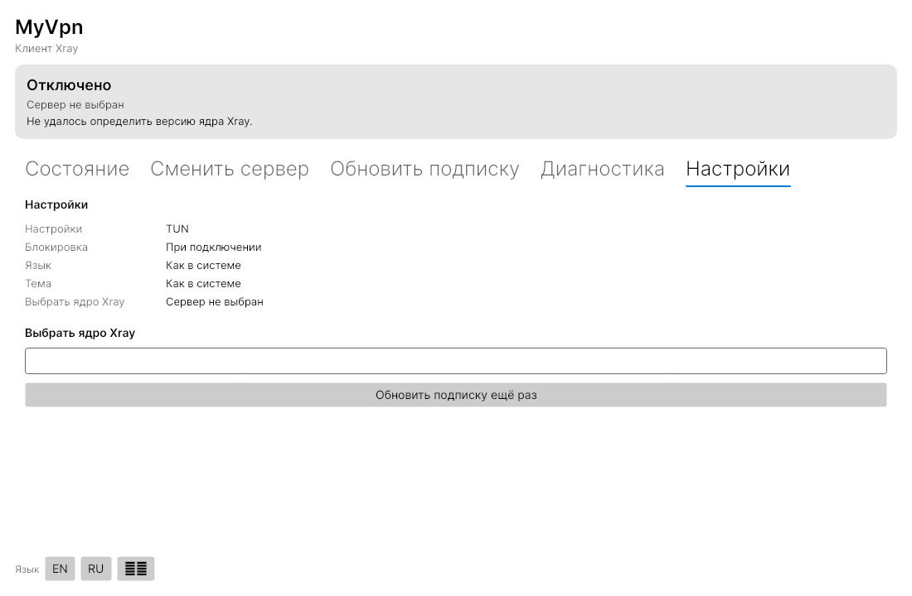
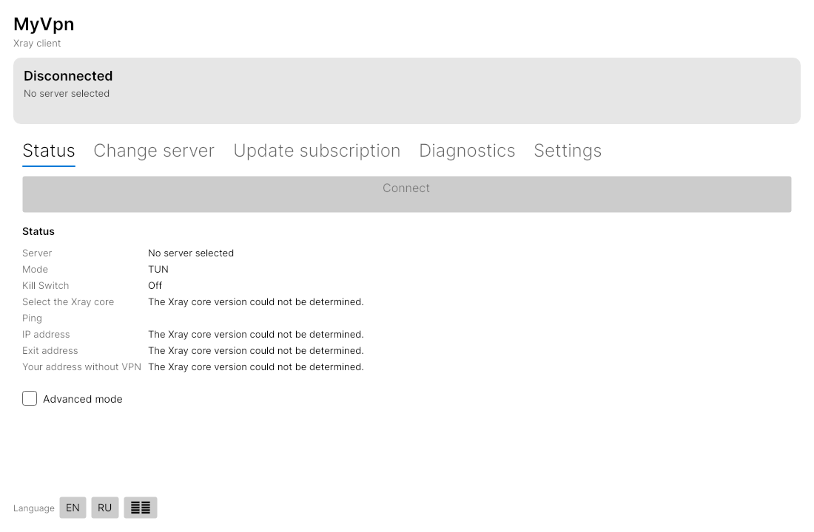
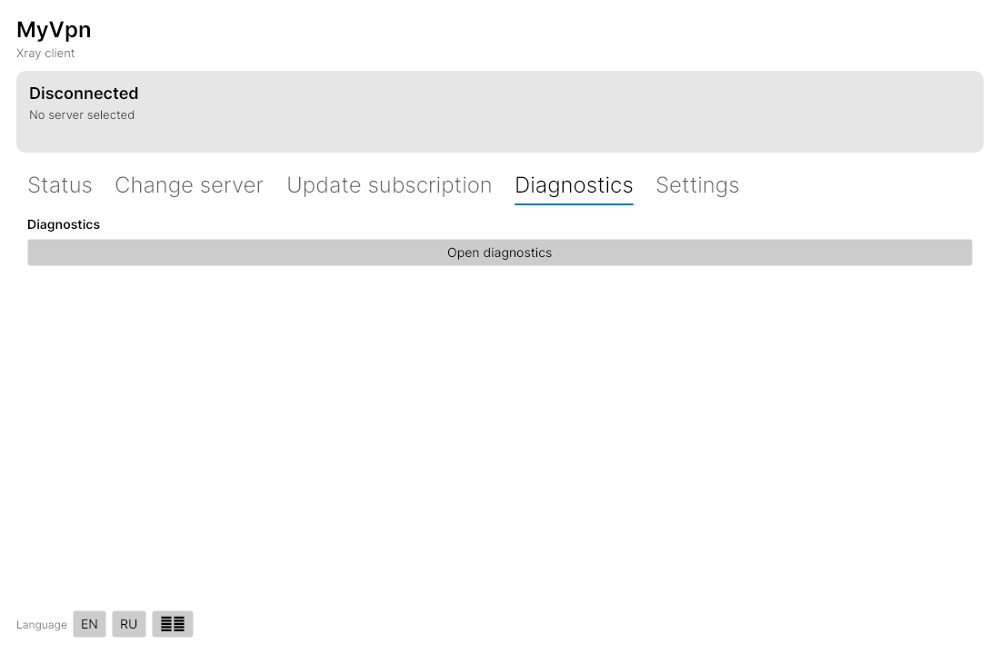

# MyVpn

> 🇷🇺 Русская версия · [English](README.md)

**MyVpn** — кроссплатформенный десктопный VPN-клиент на **Xray-core** (и только на нём),
использующий **нативный TUN-инбаунд** Xray как единственное сетевое ядро.
C# / .NET 8, Avalonia UI.

**Это вайбкод-проект — и это его главная фича, а не баг.** Он собран быстро и итеративно,
но с одним жёстким правилом: всё, что заявлено, — проверено, а всё, что не проверено, —
честно подписано. Его главное предназначение — быть **удобной и понятной основой, на
которой вы соберёте свой собственный VPN-клиент**: форкайте, выкидывайте лишнее,
меняйте под себя.

## Что это такое

- Один сетевой движок: **Xray-core**. Никакого sing-box — это запрещено и проверяется в CI.
- TUN — только **нативный** Xray TUN (`"protocol": "tun"`), не сторонняя TUN-обёртка.
- Чистая архитектура: `Core → Application → Infrastructure → Platform.{Linux,Windows,MacOS} → {UI, CLI, Service}`.
- Каждая ОС — тонкий исполнитель за интерфейсом; ни одной команды через `sh -c`.
- Честный статус: что реально проверено, а что «собирается, но вживую не запускалось».

## Для кого этот проект

Если вы хотите сделать **свой VPN-клиент** — свой бренд, свои протоколы, своя логика,
свой UI — и не хотите начинать с нуля, этот репозиторий задуман как стартовая точка.
Здесь уже решены и задокументированы самые болезненные места, о которые обычно
разбиваются самодельные клиенты:

- **Маршрутизация**: как правильно сместить default-маршрут и не оставить хост без сети
  (с регресс-тестом на реальном ядре, включая коварный случай `metric 0`);
- **Kill Switch** с fail-closed семантикой: nftables / WFP / PF;
- **Безопасная подписка**: SSRF-защита, consent-модель для заголовков, подписка не может
  сама перенастроить клиента;
- **Geo-данные** без классического бага v2rayN
  [#9765](https://github.com/2dust/v2rayN/issues/9765);
- **Пакеты** `.deb` / `.rpm` / AppImage / `.zip` / `.app` прямо из CI.

## Быстрый старт

### Скачать готовый пакет

[**Релиз v0.1.0**](https://github.com/kitten443/xclient/releases/tag/v0.1.0-alpha.1) —
пакеты для пяти платформ. Внутри уже лежат **Xray-core 26.9.9** и geo-данные —
докачивать ничего не нужно. Пакеты **не подписаны** (SmartScreen и Gatekeeper будут
предупреждать — это ожидаемо).

### Собрать из исходников

```bash
# Нужен .NET 8 SDK
dotnet build MyVpn.sln -c Release
dotnet test  MyVpn.sln        # 1279 тестов, все зелёные
```

## Как это выглядит

Графический интерфейс (Avalonia), пять вкладок, переключение языка на лету:





## Что проверено

- **1279 тестов зелёные**, два полных прогона подряд;
- **CI зелёный** на четырёх раннерах (Windows, Linux x64/arm64, macOS arm64);
  macOS Intel — по запросу (GitHub выводит образ `macos-13`);
- **Реальный TUN-туннель без root**: настоящие маршруты, nftables и HTTP через туннель
  в изолированном сетевом namespace;
- live-проверка в proxy-режиме на реальной подписке (XHttp+TLS, XHttp+REALITY,
  gRPC+REALITY) — выходной адрес отличается от адреса хоста;
- CI собирает и пакует релизные артефакты на каждый пуш; хеши в релизе сверены с
  манифестами сборки.

## Что (пока) НЕ проверено — честно

- **Windows и macOS ни разу не запускались вживую** — только сборка и unit-тесты в CI;
- TUN-режим не гонялся против реального удалённого сервера (только против ядра в
  изолированном namespace);
- нет привилегированного сервиса и IPC — исполнители пока работают в процессе;
- per-app маршрутизация — только Linux;
- пакеты не подписаны;
- китайский UI требует системного CJK-шрифта (в поставке только Inter).

Полный и честный список — в описании релиза и в [English README](README.md).

## Сделать свой клиент на этой основе

1. **Форк → клон.**
2. **Ребрендинг**: `Directory.Build.props` (`Authors`, `Product`, `VersionPrefix`),
   `AssemblyName` в head-проектах, иконка `src/MyVpn.UI/Assets/myvpn.png`,
   `build/packaging/myvpn.desktop`.
3. **Своя логика** — в `MyVpn.Core` и `MyVpn.Application`; ОС-специфика — в
   `MyVpn.Platform.*`.
4. **Не нарушайте главное правило**: UI никогда не привилегирован. Вся модель
   безопасности строится на этом.
5. Прогоните `dotnet test MyVpn.sln` и гарды (`build/check-localization.py`,
   `build/check-provenance.py`) перед публикацией.

### ⚠️ Важно про лицензию

Проект — **GPL-3.0-only**. Это значит: **любой клиент, сделанный на его основе, тоже
обязан быть GPL-3.0-only и открытым.** Взять этот код, закрыть его и продавать — нельзя.
Если вам нужен закрытый коммерческий продукт, этот репозиторий как основа не подходит.

Xray-core — **MPL-2.0** и используется как отдельный неизменённый процесс: он не
«приклеивает» свою лицензию к вашему коду.

## Документация

- [English README](README.md) — полная техническая версия
- [ADR 0001–0012](docs/adr/) — почему приняты именно такие решения
- [Исследования](docs/research/) — 8 отчётов со ссылками на первоисточники
- [Провенанс и список «не копировать»](docs/provenance.md)
